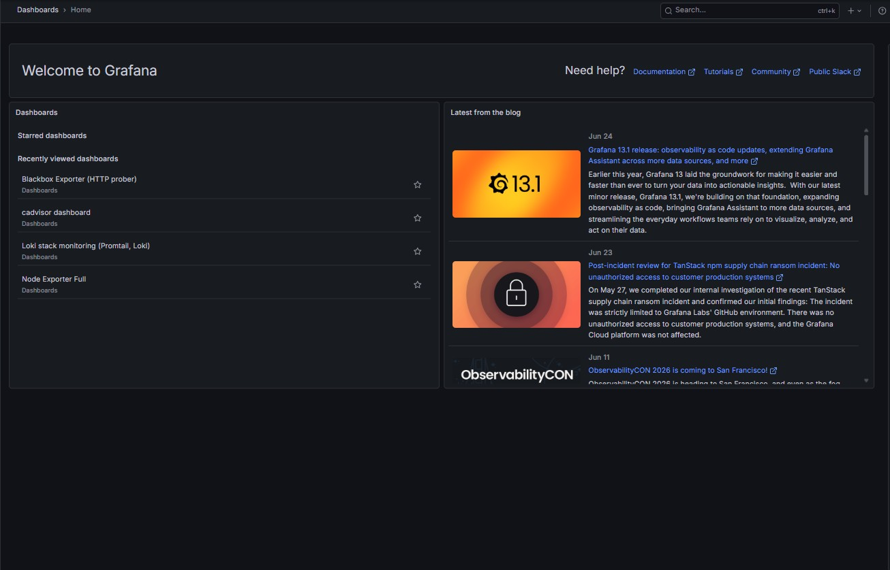
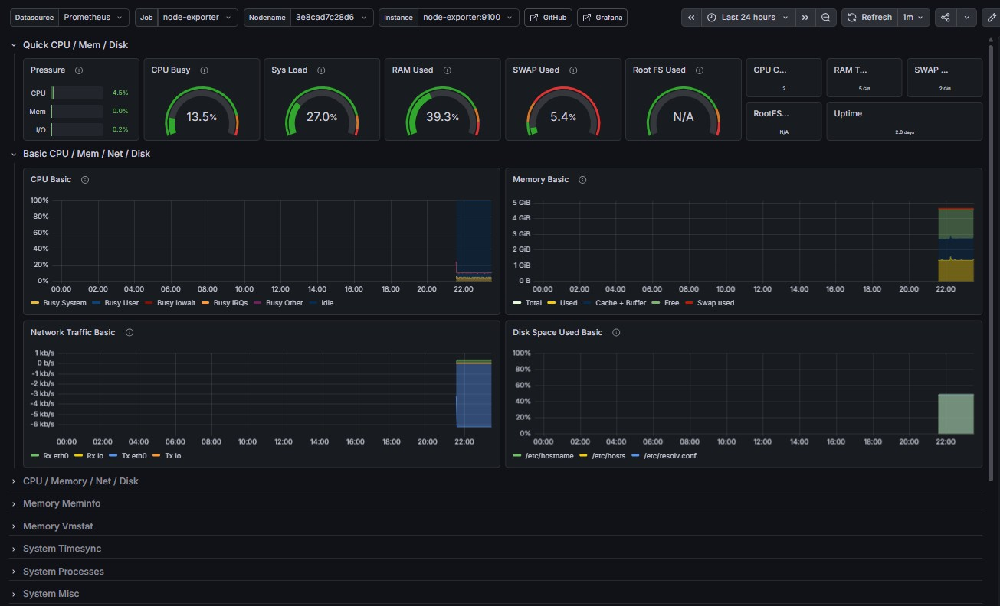
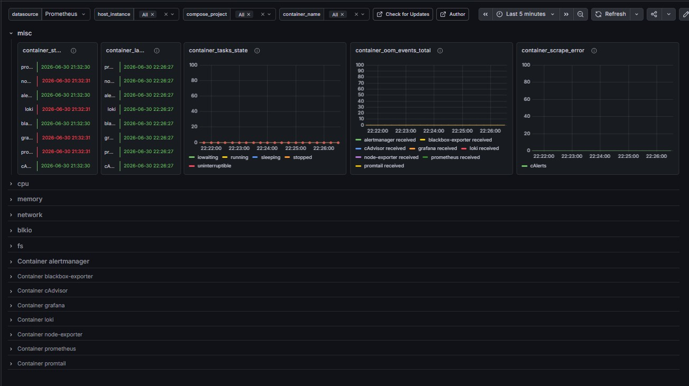
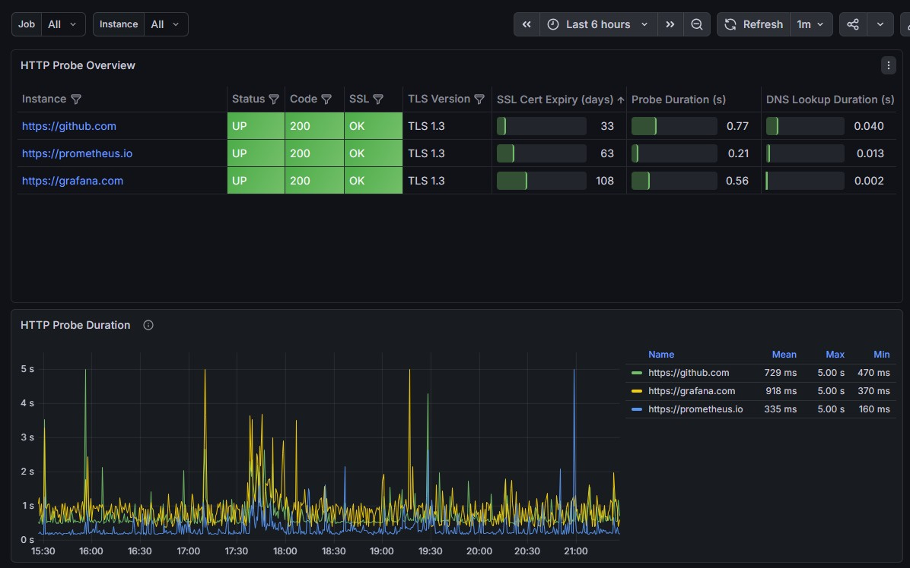
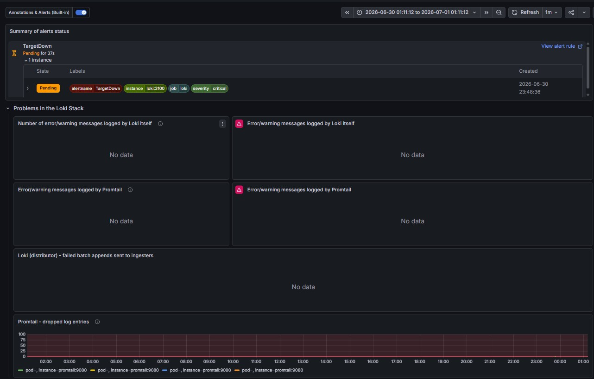
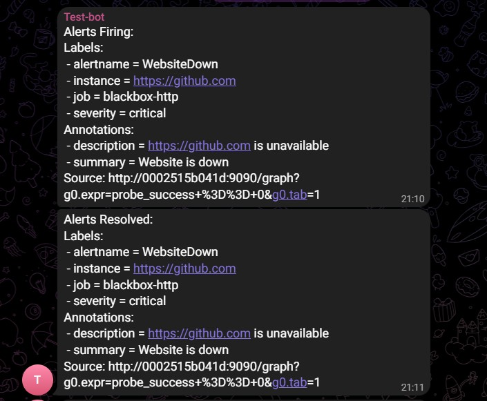

# Monitoring Stack

A production-inspired monitoring and logging stack built with Docker Compose.

This project was created as part of my DevOps portfolio to demonstrate practical experience with infrastructure monitoring, centralized logging, visualization, alerting, and service health checks using popular open-source tools.

---

## Features

* Metrics collection with **Prometheus**
* Pre-configured **Grafana** dashboards
* Host monitoring using **Node Exporter**
* Container monitoring using **cAdvisor**
* Centralized logging with **Loki** and **Promtail**
* HTTP endpoint monitoring using **Blackbox Exporter**
* Alerting with **Alertmanager**
* Telegram alert notifications
* Automatic Grafana provisioning (datasources and dashboards)
* Fully containerized deployment with Docker Compose

---

## Technology Stack

| Component         | Purpose                         |
| ----------------- | ------------------------------- |
| Docker Compose    | Service orchestration           |
| Prometheus        | Metrics collection              |
| Grafana           | Visualization                   |
| Loki              | Log aggregation                 |
| Promtail          | Log shipping                    |
| Alertmanager      | Alert routing                   |
| Node Exporter     | Host metrics                    |
| cAdvisor          | Container metrics               |
| Blackbox Exporter | Website and endpoint monitoring |

---

## Architecture

```text
                    +------------------+
                    |     Grafana      |
                    +--------+---------+
                             |
            +----------------+----------------+
            |                                 |
      +-----v------+                   +------v------+
      | Prometheus |                   |    Loki     |
      +-----+------+                   +------+------+
            |                                 ^
   +--------+---------+                       |
   |        |         |                 +-----+------+
   |        |         |                 |  Promtail  |
   |        |         |                 +------------+
   |        |         |
+--v--+ +---v---+ +---v---------------+
|Node | |cAdvisor| |Blackbox Exporter |
|Exporter|        | |                  |
+------+ +--------+ +------------------+

             |
             v

      +--------------+
      | Alertmanager |
      +------+-------+
             |
             v
        Telegram Bot
```

---

## Project Structure

```text
.
├── alertmanager/
├── blackbox/
├── grafana/
│   ├── dashboards/
│   └── provisioning/
├── loki/
├── prometheus/
│   └── rules/
├── promtail/
├── docker-compose.yaml
└── README.md
```

---

## Quick Start

Clone the repository:

```bash
git clone https://github.com/Xenon1359/monitoring-stack-project.git
cd monitoring-stack-project
```

Start the monitoring stack:

```bash
docker compose up --build
```

---

## Services

| Service           | Port     |
| ----------------- | -------- |
| Grafana           | 3000     |
| Prometheus        | 9090     |
| Alertmanager      | 9093     |
| Node Exporter     | 9100     |
| cAdvisor          | 8080     |
| Loki              | 3100     |
| Blackbox Exporter | 9115     |
| Promtail          | Internal |

---

## Grafana Dashboards

The project includes four pre-configured dashboards:

* Node Exporter Dashboard
* cAdvisor Dashboard
* Blackbox Exporter Dashboard
* Loki Dashboard *(currently being improved)*

### Grafana Home



### Node Exporter Dashboard



### cAdvisor Dashboard



### Blackbox Exporter Dashboard



### Loki Dashboard



---

## Alerting

The following Prometheus alert rules are configured:

| Alert          | Description                                           |
| -------------- | ----------------------------------------------------- |
| HostHighCPU    | CPU usage above 80%                                   |
| HostHighMemory | Memory usage above 90%                                |
| HostHighDisk   | Disk usage above 85%                                  |
| TargetDown     | Prometheus target unavailable                         |
| WebsiteDown    | Website monitored by Blackbox Exporter is unavailable |

Alerts are routed through Alertmanager and delivered directly to a Telegram bot.

### Telegram Configuration

Configure your Telegram credentials inside:

```text
alertmanager/alertmanager.yml
```

Replace the following values:

* Telegram Bot Token
* Chat ID

### Example Alert



---

## Grafana Provisioning

Grafana is automatically provisioned during startup.

The project automatically imports:

* Prometheus datasource
* Loki datasource
* Pre-configured dashboards

No manual Grafana configuration is required.

---

## Skills Demonstrated

This project demonstrates my practical experience with:

* Docker Compose
* Infrastructure monitoring
* Metrics collection
* Centralized logging
* Prometheus configuration
* PromQL
* Grafana dashboards
* Grafana provisioning
* Alertmanager
* Telegram integrations
* Blackbox monitoring
* Container monitoring
* Linux services
* YAML configuration
* Infrastructure troubleshooting

---

## Future Improvements

* Improve the Loki dashboard
* Add SSL certificate monitoring
* Add recording rules
* Add Grafana authentication
* Add persistent storage for Grafana
* Expand alert coverage
* Deploy the stack on Kubernetes
